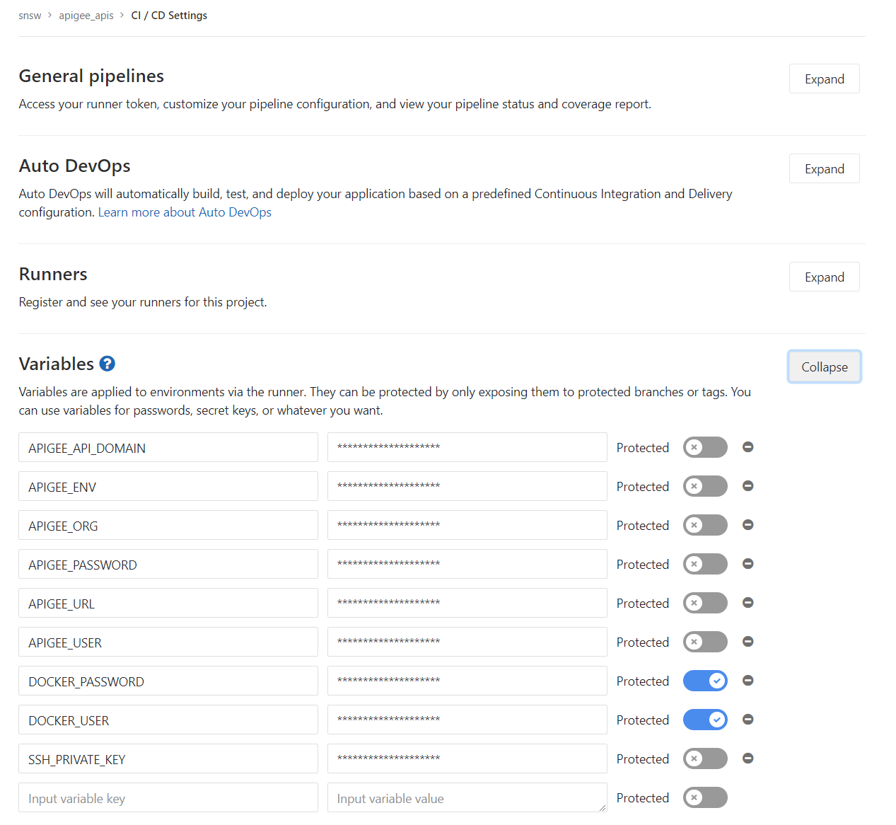
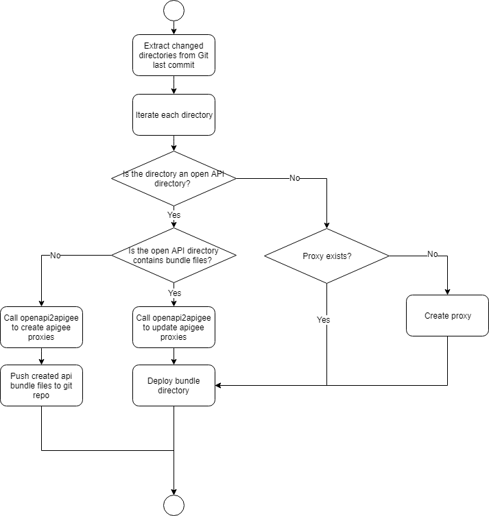

# Apigee Automation


This repository contains a set of scripts to create / update automatically api proxies on Apigee.


## proxy_sync.sh

The script scans Git changes within an API directory and create/update corresponding Apigee proxies dynamically. 

- It supports create/update Apigee proxies with Apigee bundle files. 
- It supports create/update Apigee proxies based on Open API document(As Open API directory, with or without bundle files).
- It supports shared policies and manage configuration as code.
- It provides Docker image to integrate with CI pipeline.

### How to use it

1. Create a Gitlab repository
2. Add an API directory. The script supports 3 types of API directory. 
   - Apigee bundle directory
   - Open API directory without bundle files
   - Open API directory with bundle files
   
   Please refer to apigee_apis repository for more information. 
3. Add .gitlab-ci.yml
    ```
    image: registry.gitlab.com/daru-public/apigee_automation
    
    services:
    - docker:dind
    
    build-master:
      stage: build
      script:
      - ls -R
      - bash /code/apigee_automation/proxy_sync.sh
      only:
      - master
    ```
4. Configure Gitlab repository's CI/CD settings.  
   ```
   #Add these variables to CI/CD settings.
   APIGEE_USER=Apigee Username
   APIGEE_PASSWORD=Apigee password
   APIGEE_ORG=Apigee Organization
   APIGEE_URL=https://api.enterprise.apigee.com
   APIGEE_API_DOMAIN=apigee.net
   APIGEE_ENV=Apigee environment
   SSH_PRIVATE_KEY=Deployment private key
   ```
   
5. Done. 

If everything goes fine. For every change of the API directory will be automatically synchronized to Apigee Edge.
   
> For Open API directory without bundle files, if deployment key variable SSH_PRIVATE_KEY is set. It will push generated Apigee bundle files to Git repository for your convenience. 
> - How to generate deployment key, [https://docs.gitlab.com/ee/ssh/#deploy-keys](https://docs.gitlab.com/ee/ssh/#deploy-keys)
> - The bundle files are used as template for Open API directory. So the following placeholders should not be changed. This is also required by Open API directory with bundle files.
>   1. targets/default.xml must define &lt;URL/>
>   2. proxies/default.xml must define &lt;Flows/> 

### How it works  

The script scans changed files from Git's last commit to detect which API directory changed.
 
1. For API bundle directory  
If the API bundle does not exist, create the proxy, and then deploy bundle file to apigee. 

2. For open API without bundle directory  
Invoke openapi2apigee to create or update the proxies. Push created bundle file to git remote repository. 

3. For open API with bundle directory  
Invoke openapi2apigee to create or update the proxies. Update bundle file target's basepath and proxies's flow. and then deploy bundle file to apigee. 

<br>
