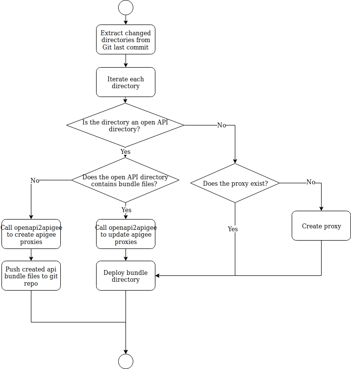

# Apigee Automation


This repository contains a set of scripts to create / update automatically api proxies on Apigee.


## proxy_sync.sh

The script scans Git changes within an API directory and create/update corresponding Apigee proxies dynamically. 

- It supports create/update Apigee proxies with Apigee bundle files. 
- It supports create/update Apigee proxies based on Open API document(As Open API directory, with or without bundle files).
- It supports shared policies and manage configuration as code.
- It provides Docker image to integrate with CI pipeline.

### How to use it

1. Create a Gitlab repository
2. Add an API directory. The script supports 3 types of API directory. 
   - Apigee bundle directory
   - Open API directory without bundle files
   - Open API directory with bundle files
   
   Please refer to apigee_apis repository for more information. 
3. Add .gitlab-ci.yml
    ```
    image: registry.gitlab.com/daru-public/apigee_automation
    
    services:
    - docker:dind
    
    build-master:
      stage: build
      script:
      - ls -R
      - bash /code/apigee_automation/proxy_sync.sh
      only:
      - master
    ```
4. Configure Gitlab repository's CI/CD variables.  
   ```
   APIGEE_USER=Apigee Username
   APIGEE_PASSWORD=Apigee password
   APIGEE_ORG=Apigee Organization
   APIGEE_URL=https://api.enterprise.apigee.com
   APIGEE_API_DOMAIN=apigee.net
   APIGEE_ENV=Apigee environment
   SSH_PRIVATE_KEY=Deployment private key
   APIGEE_SEAMLESS_DEPLOYMENT=defined
   ```
   
   
   **SSH_PRIVATE_KEY**
   
   SSH_PRIVATE_KEY is the deployment key. For Open API directory without bundle files, if SSH_PRIVATE_KEY is set, the script will push generated Apigee bundle files to Git repository for your convenience. 
   - How to generate deployment key, [https://docs.gitlab.com/ee/ssh/#deploy-keys](https://docs.gitlab.com/ee/ssh/#deploy-keys)
     
   **APIGEE_SEAMLESS_DEPLOYMENT**
   
   APIGEE_SEAMLESS_DEPLOYMENT is used for seamless deployment (zero downtime). It will undeploy previous deployment after new deployment completed. The default grace period (delay) is 15 seconds.
     > You cannot deploy one revision of an API proxy on top of another. The first must always be undeployed. By setting override to true, you indicate that one revision of an API proxy should be deployed over the currently deployed revision. The result is that the deployment sequence is reversed--the new revision is deployed, and once the deployment is complete, the already deployed revision is undeployed. 
     > [https://docs.apigee.com/api-platform/deploy/deploy-api-proxies-using-management-api#seamless](https://docs.apigee.com/api-platform/deploy/deploy-api-proxies-using-management-api#seamless) 
   
5. Done.  

If everything goes fine. For every change of the API directory will be automatically synchronized to Apigee Edge.
   
### How to use it for existing Apigee proxy
1. Download remote proxy bundle files.
   ```bash
   proxy_export.sh --proxy=name --directory=./ --APIGEE_USER=username --APIGEE_PASSWORD=password  --APIGEE_ORG=organization
   ```
2. Update the bundle files as needed.
3. Commit the changes.

### How it works  

The script scans changed files from Git's last commit to detect which API directory changed.
 
1. For API bundle directory  
If the API bundle does not exist, create the proxy, and then deploy the bundle files to apigee. 

2. For open API without bundle directory  
Invoke openapi2apigee to create or update the proxies. Add the proxy bundle to the Git repository. 

3. For open API with bundle directory  
Invoke openapi2apigee to create or update the proxy. Update bundle file target's basepath and proxies's flow. and then deploy bundle file to apigee. 

<br>


## proxy_merge.sh

The script merges existing remote proxy bundle files with local bundle files.

```bash
cd apigee_apis 
proxy_merge.sh --proxy=name --force=true --APIGEE_USER=username --APIGEE_PASSWORD=password  --APIGEE_ORG=organization
```
**NOTE: The script must run within API directory.**

### Options

- proxy  
  Optional. Specify to merge which api proxy's bundle files. If proxy is not specified, the script will scan all sub directories and merge all proxies. 

- force  
  Optional. Force to use remote bundle files override local bundle files. If not specified, the script will compare local/remote bundle's file last modified time, use the newer files.
  
- APIGEE_USER, APIGEE_PASSWORD, APIGEE_ORG  
  Optional. Apigee variables. The script arguments will override global bash Apigee variables.
  
## proxy_export.sh

The script export existing remote proxy bundle files to local.

```bash
cd apigee_apis 
proxy_export.sh --proxy=name --directory=/tmp/backup --APIGEE_USER=username --APIGEE_PASSWORD=password  --APIGEE_ORG=organization
```
**NOTE: The script must run within API directory.**

### Options

- proxy  
  Optional. Specify to export which api proxy's bundle files. If proxy is not specified, the script will scan all sub directories and export all proxies. 

- directory  
  Optional. Output directory. Default to current directory.
  
- APIGEE_USER, APIGEE_PASSWORD, APIGEE_ORG  
  Optional. Apigee variables. The script arguments will override global bash Apigee variables.
  

## Product Sync

The script scans Git changes within the api-products directory and create/update corresponding Apigee products dynamically. 

### Usage

1. Create a Gitlab repository with a directory api-products. 
2. Add product JSON to api-products. File example:

    ```
    {
        "apiResources": [
            "/"
        ],
        "approvalType": "auto",
        "attributes": [
            {
                "name": "access",
                "value": "public"
            }
        ],
        "description": "",
        "displayName": "Test Product",
        "environments": [
            "dev",
            "sandbox"
        ],
        "name": "TEST-PRODUCT1",
        "proxies": [
            "team-apiname"
        ],
        "quota": "1000000",
        "quotaInterval": "1",
        "quotaTimeUnit": "minute",
        "scopes": [
            "owner.read",
            "owner.create",
            "owner.update",
            "owner.delete"
        ]
    }
    ```
3. Add .gitlab-ci.yml
    ```
    image: registry.gitlab.com/daru-public/apigee_automation
    
    services:
    - docker:dind
    
    build-master:
      stage: build
      script:
      - ls -R
      - bash /code/apigee_automation/product_sync.sh
      only:
      - master
    ```
4. Configure Gitlab repository's CI/CD settings.  
   ```
   #Add these variables to CI/CD settings.
   APIGEE_USER=Apigee Username
   APIGEE_PASSWORD=Apigee password
   APIGEE_ORG=Apigee Organization
   APIGEE_URL=https://api.enterprise.apigee.com
   APIGEE_API_DOMAIN=apigee.net
   APIGEE_ENV=Apigee environment
   ```
5. Done. Push Git changes will trigger Gitlib pipeline to sync Apigee products.  


## Product Creation

The script finds a product name from the json file. If the product exists, it will update it. If not, it will create the product.

Usage:

```bash
./product_creation.sh --file=product.json --APIGEE_USER=<YOUR_USER> --APIGEE_PASSWORD=<YOUR_PASSWORD> --APIGEE_ORG=<YOUR_ORG> --APIGEE_URL=https://api.enterprise.apigee.com
```

File example:
product.json:
```
{
    "apiResources": [
        "/"
    ],
    "approvalType": "auto",
    "attributes": [
        {
            "name": "access",
            "value": "public"
        }
    ],
    "description": "",
    "displayName": "Test Product",
    "environments": [
        "sandbox",
        "dev"
    ],
    "name": "TEST-PRODUCT1",
    "proxies": [
        "team-apiname"
    ],
    "quota": "1000000",
    "quotaInterval": "1",
    "quotaTimeUnit": "minute",
    "scopes": [
        "owner.read",
        "owner.create",
        "owner.update",
        "owner.delete"
    ]
}
```
  
